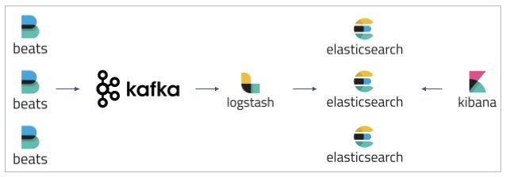

# ELK
How to set up Filebeat, Kafka, Logstash and Elasticsearch
## Use Case
Visualizing data is an essential step to give value to data. According to your use case, I will give you some tips to build a robust architecture to send, process, store and visualize your data.
# Architecture

# Explanation

**Filebeat:** is an agent to ship data. If it's configured well, you can deal with a lot of data without any risk of data loss. It is possible to send data to logstash, elasticsearch,kafka...However, **you can use a single output**.

**Kafka:**  is like a queue that we can use to store data per topic. Topic is similar to a key that is used to store a type of data. For example, if you have two server that generate log files, you can create two topics (server1-log, server2-log) and set-up filebeat to send log from server1 to the first topic and from server2 to the other one. The possibility to have multiple topics could be usefull to deal with the constraint to have only one output in filebeat.

**Logastash:** I recommend to use logstash and not another software to parse data ingested into kafka, beacause it's easier to set-up the output and sending data to Elasticsearch. 

**Elasticsearch:** Elasticsearch is a distributed, RESTful search and analytics engine capable of addressing a growing number of use cases.

**Kibana:** is an open source data visualization plugin for Elasticsearch.
